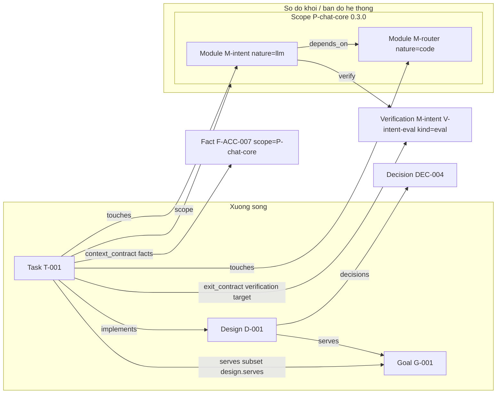

# Khái niệm cốt lõi của ganas

Tài liệu này là bản THAM CHIẾU ĐẦY ĐỦ về mô hình dữ liệu của ganas — dành cho
người tò mò muốn hiểu sâu, và cho một AI agent cần nắm toàn cảnh hệ thống
trước khi thao tác lên một dự án dùng ganas. Nó KHÔNG phải bản tóm tắt ngắn
kiểu `CLAUDE.md`/`SKILL.md` (những file đó cố ý ngắn để đỡ tốn context mỗi
phiên) — file này được phép dài, được phép đi sâu vào từng field.

File này tự đứng độc lập: không giả định bạn đã đọc gì khác trước đó. Hai tài
liệu song song, khác phạm vi:
- `docs/COMMANDS.md` — tham chiếu đầy đủ từng lệnh CLI (flags, options).
- `docs/WORKFLOW.md` — đi qua một luồng làm việc đầu-cuối, từng bước.

Ở đây chỉ nhắc tên lệnh khi cần minh hoạ (vd "chạy `ganas verify`"), không
liệt kê flags. Mọi khẳng định dưới đây được đối chiếu trực tiếp với source
code tại thời điểm viết (`src/model/`, `src/graph/`, `src/verify/`) — không
suy đoán từ "tool tương tự thường làm gì".

## 1. Triết lý cốt lõi

Ganas tồn tại vì hai vấn đề gắn liền với việc dùng agent AI để code trong
thời gian dài: (1) phiên làm việc mất ngữ cảnh giữa các lần mở lại — không có
gì buộc phiên sau phải biết phiên trước đã học được gì; và (2) agent có thể
"ảo giác" — tuyên bố một điều đã được kiểm chứng trong khi thực ra chỉ là suy
diễn từ trí nhớ hoặc kiến thức chung, không có bằng chứng nào chống lưng.
Đúng nguyên văn luật ghi tri thức mà ganas sinh ra cho mọi dự án dùng nó
(`knowledgeRuleMd()`, `src/templates/project.ts`):

> Kho tri thức của dự án nằm ở `.ganas/`. Mọi thứ ghi vào đó đều thuộc đúng
> một trong ba loại. Ghi sai loại là lỗi nghiêm trọng hơn là không ghi.

Và điều tuyệt đối không làm, cũng nguyên văn:

> ❌ Ghi kết luận suy ra từ trí nhớ hoặc từ kiến thức chung mà không chỉ được
> nguồn
> ❌ Nâng một claim lên fact mà không chạy probe
> ❌ Sửa `last_verified_at` bằng tay mà không thật sự chạy verify
> ❌ Viết tổng kết văn xuôi rồi coi đó là tri thức dự án

Câu trả lời của ganas không phải "tóm tắt tự do tốt hơn" — mà là một mô hình
dữ liệu có cấu trúc (xương sống Goal→Design→Task, sơ đồ khối, ba loại tri
thức) cộng với một sổ cái xác minh append-only mà model không tự ghi tay
được. Đúng như docstring đầu file của sổ cái (`src/verify/ledger.ts`) nói:

> Đây là thứ khiến `last_verified_at` không tự khai được. Không có nó thì
> `ganas verify` chỉ là nghi lễ: model ghi `last_verified_at: <hôm qua>` +
> `last_result: pass` vào YAML là xong, không cần chạy gì.

Nói ngắn: ganas không tin "agent nói nó đã kiểm tra" — nó chỉ tin thứ có thể
truy lại được: một dòng trong sổ cái, một anchor trỏ vào file/commit/URL cụ
thể, một chữ ký người cho quyết định.

Lưu ý phạm vi: một số ý tưởng từng bàn trong quá trình phát triển ganas (ví
dụ `ganas suggest`/RAG cục bộ) **chưa được xây** — tài liệu này chỉ mô tả
những gì thực sự tồn tại trong source code hiện tại. Lịch sử quyết định
thiết kế từng mốc nằm trong `git log` (commit message), không phải một file
kế hoạch riêng — dự án không giữ plan trong git.

## 2. Xương sống (spine): Goal → Design → Task

Xương sống là trục "vì sao ta làm việc này" — ba lớp bắt buộc liên kết dọc
với nhau, cưỡng chế bởi cả zod schema (`src/model/`) lẫn validator liên-file
(`src/graph/validate.ts`).

### Goal (`G-001`)

`src/model/goal.ts`. Một Goal có `outcome` (kết quả người dùng cảm nhận
được, không phải việc phải làm) và bắt buộc ít nhất một `acceptance`
(tiêu chí nghiệm thu — kind `command` chạy được lệnh shell, hoặc `manual` cần
`owner` ký xác nhận). Không có tiêu chí đo được thì đó chỉ là nguyện vọng,
không phải mục tiêu — luật này nằm ngay trong thông báo lỗi của schema.

`status` là một trong `draft` / `active` / `closed`. Ràng buộc quan trọng:
Goal ở trạng thái `active` **bắt buộc** phải có `approved_by` (một handle
người, dạng `@ten`) — model không được tự đặt goal cho chính mình, phải giữ
ở `draft` cho tới khi có người duyệt. `approved_by` có thì `approved_at`
cũng phải có.

### Design (`D-001`)

`src/model/design.ts`. Design chỉ tồn tại để phục vụ Goal: field `serves`
(mảng Goal ID) **bắt buộc và không được rỗng** — đây là luật chặn "20 design
trôi nổi không neo vào đâu". Có `summary` (một đoạn: cách tiếp cận và vì sao
chọn nó), `decisions` (mảng Decision ID mà design này dựa vào), `supersedes`
(design nào nó thay thế), `status` (`draft`/`active`/`superseded`/
`archived`).

Validator (`spine/design-missing-goal`) bắt lỗi nếu `serves` trỏ vào Goal
không tồn tại; `spine/design-serves-draft-goal` cảnh báo nếu Goal đó còn
`draft` (chưa duyệt); `spine/design-orphaned` cảnh báo nếu mọi Goal design
phục vụ đã `closed` mà design chưa `archived`/`superseded`.

### Task (`T-001`)

`src/model/task.ts`. Task là đơn vị việc thực thi được trong một phiên. Các
ràng buộc liên kết xương sống, siết chặt bởi cả zod lẫn
`src/graph/validate.ts`:

- `serves`: mảng Goal ID, bắt buộc không rỗng.
- `implements`: đúng một Design ID — design mà task này hiện thực.
- `scope`: đúng một Phạm vi ID — task luôn thuộc về một phạm vi công việc.

**Luật liên kết quan trọng nhất của xương sống**
(`spine/task-goal-not-in-design`, trong `validate.ts`): mọi Goal mà `task.serves`
liệt kê phải nằm trong tập Goal mà `design.serves` (của design task đang
`implements`) đã liệt kê. Nói cách khác, `task.serves` phải là **tập con**
của `design.serves` — task không được tự ý phục vụ một Goal mà design của nó
không phục vụ. Nguyên văn hint khi vi phạm:

> Hoặc bổ sung goal vào design ..., hoặc chuyển task sang design khác. Spine
> phải liền mạch task → design → goal.

Luật song song trên trục HỆ THỐNG (`scope/task-touches-outside-scope`, severity
`error`): mọi khối trong `task.touches` phải nằm trong `scope.modules` của phạm
vi task thuộc về. Một task chạm hai phạm vi thì không ai nghiệm thu được nó.

**`context_contract`** — trả lời "phiên mới cần THÔNG TIN gì", chính là thứ
`SessionStart` render vào brief đầu phiên:
- `must_read`: mảng `{ path, why }` — mỗi file kèm lý do bắt buộc, để phiên
  sau không đọc mò.
- `facts`: mảng Fact ID — Fact chỉ được coi là đáng tin khi còn FRESH (xem
  mục 6), brief cảnh báo nếu STALE.
- `open_questions`: câu hỏi còn bỏ ngỏ, dạng chuỗi tự do.

**`exit_contract`** — điều kiện "done" kiểm chứng được; Stop hook chấm dựa
vào đây, chưa thoả thì phiên không "xong" được. Đúng **5 loại**
(`zExitCriterion`, discriminated union theo `kind`, `src/model/task.ts`):

| `kind` | Field riêng | Ý nghĩa |
| --- | --- | --- |
| `command` | `run`, `expect` | Chạy lệnh shell, so kết quả với `expect` |
| `artifact` | `path`, `must_contain?` | Một file phải tồn tại, tuỳ chọn phải chứa chuỗi nào đó |
| `handoff` | `required` (mặc định `true`) | Bắt buộc sinh handoff cuối phiên |
| `manual` | `check` | Người phải tự xác nhận |
| `verification` | `target` | Một target trong **sổ cái** (`M-intent/V-intent-eval` hoặc `F-ACC-001`) phải **FRESH** |

`kind: verification` là cầu nối bắt buộc giữa `touches` (khối task chạm tới)
và bằng chứng thật của khối đó — không có nó, task có thể "done" mà chưa ai
chạy `ganas verify` lên khối vừa sửa. Đây chính là điều luật
`spine/task-missing-verification` cưỡng chế: nếu `task.touches` khác rỗng,
**mỗi** khối trong đó phải có ít nhất một tiêu chí `kind: verification` trỏ
vào nó (hoặc vào `${moduleId}/${verificationId}` của nó) trong
`exit_contract`.

Các field khác của Task:
- **`touches`**: mảng Module ID — điểm nối giữa trục VIỆC (task) và trục HỆ
  THỐNG (sơ đồ khối). Chạm khối nào thì phải để lại bằng chứng cho khối đó.
  `renderBrief()` còn tự suy `paths`/`entrypoints` từ `touches` để bơm vào
  brief, khỏi cần khai tay lại trong `must_read`.
- **`skills`**: mảng chuỗi — kỹ năng cần cho task, để brief biết nạp
  `SKILL.md` nào. Gộp cùng `skills` của mọi Module trong `touches` khi render
  brief (dedupe qua `Set`).
- **`model`**: một trong `MODEL_TIER` (`main`/`verifier`/`scribe`, xem
  `src/model/config.ts`) — gợi ý tier model nên dùng khi giao task này cho
  sub-agent hay phiên mới. **Đây là quyết định của người/agent lúc chẻ task
  từ plan, KHÔNG suy tự động từ `module.nature`** — comment trong
  `task.ts` nói rõ heuristic tự suy không đáng tin bằng người hiểu rõ việc.
  Không gán thì brief không gợi ý gì, không đoán bừa.
- `estimated_context`: `small`/`medium`/`large` — `large` bị validator cảnh
  báo (`spine/task-too-large`): task quá lớn buộc phải compact giữa chừng,
  và đó là lúc tri thức bị mất hoặc bị bóp méo.
- `blocked_by`: mảng Task ID chặn task này; validator phát hiện chu trình
  (`spine/task-cycle`).
- `status`: `todo`/`in_progress`/`blocked`/`done` (`done` bắt buộc kèm
  `done_at`).

## 3. Cưỡng chế (enforcement) — tóm tắt cấu hình

`src/model/config.ts` định nghĩa hai mức cưỡng chế toàn cục
(`ENFORCEMENT = ["warn", "enforce"]`): `warn` chỉ cảnh báo qua
`systemMessage` (shadow mode), `enforce` khiến hook trả `decision: "block"`.
Có thể ghi đè riêng từng luật qua `enforcement_rules` (4 luật khai trong
`ENFORCEMENT_RULES`): `knowledge_anchor`, `schema`, `exit_contract`,
`task_link`. Thiếu key nào thì luật đó dùng mức mặc định
`enforcement`.

`config.models` ánh xạ 3 tier (`main`/`verifier`/`scribe`) sang model id thật
— đây là nơi `Task.model` (tier) được resolve thành model id cụ thể lúc
render brief.

## 4. Phạm vi công việc và sơ đồ khối = bản đồ hệ thống

Đây là trục HỆ THỐNG, song song với trục VIỆC ở mục 2. Điểm thiết kế cố ý,
nói thẳng trong comment đầu file `src/model/module.ts`:

> Khối — node của sơ đồ khối, đồng thời là vùng code trên bản đồ hệ thống.
> Gộp hai khái niệm làm một là có chủ đích: sơ đồ khối CHÍNH LÀ bản đồ hệ
> thống. Tiếp quản dự án cũ = khám phá dần các khối (`unmapped → surveyed →
> …`), thay vì duy trì một bản đồ code và một sơ đồ kiến trúc rồi để chúng
> lệch nhau.

Nói cách khác: không có "sơ đồ kiến trúc" vẽ tay tách biệt khỏi code thật —
`Module` vừa là node trên sơ đồ vừa trỏ thẳng vào `paths` thật trên đĩa.

### Phạm vi công việc — Scope (`P-chat-core`)

`src/model/scope.ts`. **Đơn vị mà một câu nói của người dùng được dịch sang**:
bàn giao cái gì (`title`), code nằm ở đâu (`modules` → `module.paths`), làm sao
biết là xong (`acceptance`), ai ký (`owner`). Có `version` (bắt buộc semver),
`status` (`draft`/`active`/`delivered`), `entry` (khối đầu luồng), và `window`
tuỳ chọn (`starts_at`/`ends_at` — thay vai trò Sprint cũ, đã bỏ ở M1′).

`acceptance` chạy trên **luồng đã ghép**, không phải tổng nghiệm thu từng khối:
"một luồng có thể đúng ở từng khối mà vẫn sai khi ghép".

Bất biến quan trọng nhất, và là lý do khái niệm này tồn tại:

> Mọi phát biểu (fact, claim) chỉ được coi là đúng **bên trong** một phạm vi.
> Ra ngoài là chưa biết.

`depends_on` và `ttl_days` chỉ khoanh được THỜI GIAN ("còn đúng nữa không"),
không khoanh được KHÔNG GIAN ("đúng ở đâu"). Không có phạm vi thì kho fact càng
lớn càng thành máy sinh ảo giác.

Hai luật chống "phạm vi thùng rác": `scope/without-acceptance` và
`scope/without-owner` cảnh báo khi phạm vi `active` mà thiếu cách nghiệm thu
hoặc thiếu người ký. Validator còn phát hiện khối mồ côi (`scope/module-orphaned`):
BFS xuôi theo `depends_on` từ `entry`, khối nào trong `modules` mà không tới được
thì cảnh báo.

**Phạm vi không bao giờ bị `ganas prune` archive**, kể cả khi đã `delivered` —
khối vẫn khai `scope:` trỏ vào nó và fact vẫn còn hiệu lực trong nó. Phạm vi là
ranh giới của tri thức, mà tri thức sống lâu hơn đợt bàn giao.

### Module (`M-intent`)

`src/model/module.ts`. Module là node của sơ đồ. Field cốt lõi:

- **`nature`**: đúng 4 giá trị (`MODULE_NATURE`) — quyết định LOẠI bằng
  chứng bắt buộc:
  - `llm` — có gọi LLM ⇒ hành vi không tất định ⇒ **bắt buộc có eval**
    (validator: khối `nature: llm` mà `verify` không có phần tử nào
    `kind: eval` thì lỗi — "Probe kiểm được cấu trúc, không kiểm được hành
    vi của LLM").
  - `code` — code thuần ⇒ cần unit test / probe.
  - `data` — schema, migration, dataset.
  - `io` — cổng ra ngoài (API, hàng đợi, filesystem). Đây cũng chính là
    ranh giới hexagonal architecture mà `architectureRuleMd()` dạy: `code`/
    `data`/`llm` là lõi, `io` là nơi CHẠM I/O thật.
- **`scope`**: phạm vi công việc chứa khối; thiếu ⇒ cảnh báo `scope/module-without-scope`. Quan hệ hai chiều với `scope.modules` phải khớp.
- **`paths`** (glob) / **`entrypoints`** — code của khối nằm ở đâu; cũng là
  căn cứ tính STALE khi file khớp glob thay đổi.
- **`contract`**: `{ inputs: Port[], outputs: Port[] }` — cổng vào/ra. Mỗi
  `Port` có `name`, `shape` (mô tả kiểu tự do, vd `"{ intent: string, score:
  number }"`), `optional` (mặc định `false`).
- **`depends_on`**: mảng Module ID — cạnh của sơ đồ, "khối này cần khối nào
  chạy trước". Validator phát hiện chu trình (`spine/module-cycle`).
- **`verify`**: mảng Verification — rỗng thì khối `unverified`, "mọi luồng
  đi qua nó đều không tin được" (nguyên văn comment schema).
- **`skills`** (thêm ở N11): kỹ năng gắn với khối — quy ước làm việc riêng
  trong vùng code này (cách chunking, convention riêng…). Gán **một lần** lúc
  khảo sát/định nghĩa khối (khác `task.model`, vốn là quyết định *per-task*
  lúc chẻ việc) — mọi task chạm khối này tự động thấy skill qua brief, không
  cần khai lại.
- `status`: `unmapped`/`surveyed`/`implemented`/`verified` — hành trình
  "tiếp quản dự án cũ" là dịch khối qua các trạng thái này. Khối tuyên bố
  `verified` mà `verify` rỗng là lỗi schema.
- `risk`: `low`/`medium`/`high`.

### Verification — 3 loại bằng chứng cho một khối

`src/model/verification.ts`. Ba loại (`VERIFICATION_KIND`), khác nhau ở BẢN
CHẤT chứ không chỉ cách chạy:

- **`probe`** — tất định, boolean. Verify CẤU TRÚC (file tồn tại, symbol
  export, config đúng). Field: `run` (lệnh shell), `expect`.
- **`eval`** — thống kê, ra điểm + ngưỡng. Verify HÀNH VI, bắt buộc cho khối
  `nature: llm`. Field: `run`, `adapter` (`json`/`promptfoo`), `threshold`
  (0–1), `margin` (0–0.5, mặc định 0 — vùng đệm quanh ngưỡng: điểm rơi vào
  `[threshold, threshold+margin)` là `marginal`, không phải pass), cộng ba
  field "dấu vân tay đối tượng đo": `dataset`, `prompt`, `model` (xem mục 6).
  `evalWeakness()`: `threshold <= 0.5` bị cảnh báo — "đoán bừa cũng qua
  được".
- **`contract`** — kiểm tương thích CẠNH giữa hai khối liền kề: cổng ra khối
  nguồn có phủ được cổng vào bắt buộc của khối đích không. Field: `to`
  (Module ID đích), `run` tuỳ chọn (lệnh kiểm bổ sung — typecheck, schema
  check).

Mọi loại đều có `tier` (`smoke`/`full` — `ganas verify` mặc định chỉ chạy
`smoke`, `full` tốn tiền hơn) và `skip_if` (lệnh thoát 0 ⇒ bỏ qua, đánh dấu
`unavailable`, **không phải** `failing` — báo fail sai độc ngang báo fresh
sai, vì một khối cần DB sẽ báo động giả mỗi phiên và người ta học cách phớt
lờ cảnh báo).

### `ganas trace` và cạnh hợp đồng (`kind: contract`)

`src/graph/trace.ts`. Phân biệt quan trọng, nguyên văn comment đầu file:

> "Cạnh" ở đây khác `depends_on` — `depends_on` chỉ khai THỨ TỰ chạy, còn
> `kind: contract` khai và kiểm THỰC SỰ output khối nguồn có phủ được input
> khối đích không.

`checkEdge()` trước tiên so cổng khai báo (`portIssues()`: mỗi input bắt
buộc của khối đích phải có input cùng tên và cùng `shape` ở output khối
nguồn); cổng lệch thì fail ngay, không chạy `run` bổ sung (cổng lệch thì
chạy lệnh cũng vô nghĩa). Cổng khớp và có `run` thì mới chạy lệnh, kết quả
`pass`/`fail`/`unprovable`.

`ganas trace` còn sinh sơ đồ Mermaid (`renderDiagram()` — Part là subgraph,
Module là node, `depends_on` là cạnh liền nét, cạnh `contract` là cạnh chấm
gắn nhãn ✓/✗) và tính **nợ kiểm chứng** (`computeDebt()`), 3 loại:
`uncovered-edge` (có `depends_on` nhưng không cạnh `contract` nào kiểm nó),
`broken-contract` (cạnh contract đang fail), `unverified-module` (khối chưa
có bằng chứng nào). Đây là góc nhìn riêng cho sơ đồ khối, trả lời đúng câu
"sơ đồ này còn hở ở đâu" — phần lớn các mục này `ganas validate` cũng bắt
được nhưng rải rác ở chỗ khác.

## 5. Tri thức có bằng chứng: Fact / Claim / Decision

`src/model/knowledge.ts` (Fact, Claim) + `src/model/anchor.ts` (Anchor,
dùng chung cho cả Fact lẫn Claim).

### Anchor — bằng chứng cho một phát biểu

`src/model/anchor.ts`. Bốn dạng (`zAnchorObject`, discriminated theo
`kind`): `file` (`path` + `line`/`line_end` tuỳ chọn), `commit` (`sha`),
`url` (**bắt buộc** `fetched_at` — "web đổi, một URL không có mốc thời gian
lấy về thì không neo được gì"), `human` (`by`, `at`, `link` tuỳ chọn). Có
dạng chuỗi rút gọn dễ gõ tay, được `parseAnchorString()` diễn giải: 
`"src/a.ts#L12-L18"`, `"src/a.ts:12"`, `"commit:abc1234"`; URL trần bị từ
chối có chủ đích (thiếu `fetched_at` thì không neo được). Không nhận dạng
được thì lỗi validate — không đoán bừa.

### Phạm vi là bắt buộc với Fact và Claim, tuỳ chọn với Decision

Fact và Claim đều bắt buộc khai `scope` — một phát biểu không biết mình đúng ở
đâu thì không vào được kho. Decision thì **tuỳ chọn, thiếu = áp cho toàn dự án**:
hai loại hỏng ngược chiều nhau. Fact ngoài phạm vi mà được tin ⇒ ảo giác; còn
Decision bị thu hẹp phạm vi nhầm ⇒ model vi phạm một ràng buộc người đã chốt,
tệ hơn. Mặc định an toàn của mỗi loại vì thế nằm ở hai phía đối nhau.

`scope` của Fact **không** được suy tự động từ `depends_on` ∩ `module.paths`:
fact không có `depends_on` sẽ mất phạm vi, fact chạm hai khối sẽ có hai phạm vi.
Công cụ chỉ GỢI Ý (`ganas scope assign`), người quyết — cùng lý lẽ với
`task.model`.

### Fact — điều kiểm chứng được bằng lệnh

Có `verify: Probe` (lệnh shell + `expect`) bắt buộc, `depends_on` (glob file
mà fact phụ thuộc — file đổi thì fact hoá STALE), `ttl_days` (hết hạn theo
thời gian dù không file nào đổi, `0` = không hết hạn), `last_verified_at`,
`last_result` (`pass`/`fail`/`unknown`), `anchors` (mặc định rỗng — Fact
KHÔNG bắt buộc `anchors` như Claim, vì bằng chứng của Fact chính là
`verify.run` có thể chạy lại), `promoted_from` (vết nếu được thăng cấp từ
một Claim). Validator chặn `last_verified_at` ở tương lai — "đường tắt dễ đi
nhất để lách hệ thống".

**Chỉ FACT còn FRESH mới được phiên sau coi là sự thật** (`isUsable()` chỉ
trả `true` cho `freshness === "fresh"`) — xem bảng đầy đủ ở mục 6.

### Claim — điều được tin nhưng chưa kiểm chứng

Luôn bị đối xử như **giả thuyết**, không phải sự thật. `anchors` **bắt buộc
không rỗng** — đây chính là điểm hook `PostToolUse` chặn ghi nếu thiếu.
`provenance`: `session`/`human`/`imported` (Claim import từ tài liệu cũ dùng
tiền tố `LC-` — legacy claim — bắt buộc `provenance: imported`, và ngược
lại). `trust`: `unverified`/`confirmed`/`refuted`/`unprovable` — đổi khỏi
`unverified` bắt buộc kèm `verdict` (đối tượng gồm `at`, `probe?`,
`evidence`, `promoted_to?`); "đổi mức tin cậy phải kèm bằng chứng, không
được đổi trần". `verdict.promoted_to` (Fact ID) chỉ hợp lệ khi
`trust: confirmed`.

### Decision — điều người đã chốt

Ràng buộc do người đặt; **model không được tạo, không được sửa** — chỉ đọc
và tuân theo, hoặc nêu mâu thuẫn cho người xử lý. Bắt buộc `decided_by`
(handle) và `decided_at`. Từ N12: hai field kiểu ADR (Architecture Decision
Record) — **`context`** (điều gì buộc phải chọn — bối cảnh, ràng buộc, lựa
chọn khác đã cân nhắc) và **`consequence`** (phải sống với gì sau khi chọn —
đánh đổi, rủi ro chấp nhận, việc kéo theo), cả hai tuỳ chọn. `statement` giữ
vai trò "Decision" trong bộ ba ADR chuẩn (Context/Decision/Consequence).
**Lưu ý:** field cũ `rationale` đã bị xoá hoàn toàn ở N12, không còn tồn tại
trong schema — không dùng lại tên này.

### Vì sao ba loại, không có loại thứ tư

Trả lời trực tiếp từ `knowledgeRuleMd()`: mỗi loại có một bộ nghĩa vụ bằng
chứng khác nhau, và trộn chúng làm một sẽ xoá mất phân biệt "đã kiểm chứng
thật" vs "mới chỉ tin" vs "người đã chốt, không tranh cãi được bằng dữ
liệu". Fact đòi một lệnh chạy lại được; Claim đòi ít nhất một anchor (nguồn
gốc) nhưng chưa đòi lệnh; Decision đòi chữ ký người chứ không đòi kiểm chứng
kỹ thuật nào — vì bản chất nó không phải một sự thật kỹ thuật, mà là một lựa
chọn con người đã đưa ra dựa trên các đánh đổi.

## 6. Sổ cái xác minh (`.ganas/verify-ledger.jsonl`)

`src/verify/ledger.ts`. Append-only, **commit vào git** — để cả team lẫn CI
đối chiếu được: người khác `pull` về là biết fact nào đã thật sự verify,
thay vì phải chạy lại từ đầu. Hook chặn mọi ghi thẳng vào file này ngoài
đường `ganas verify`/`ganas trace` — nếu không, `last_verified_at` trong
YAML chỉ là lời tự khai, không phải bằng chứng.

Mỗi dòng JSON (`LedgerEntry`) gồm: `target` (`F-ACC-001` cho fact, hoặc
`M-intent/V-intent-smoke` cho bằng chứng của khối), `kind`
(`probe`/`eval`/`contract`), `at` (thời điểm), `def` (vân tay định nghĩa),
`result` (**`LEDGER_RESULT`**: `pass`/`fail`/`marginal`/`unavailable`/
`unprovable`), và với eval: `score`, `threshold`, `n`, `passed`, `model`,
`prompt`, `dataset`, `cost_usd`. Cộng bối cảnh chạy: `by`, `git` (short
sha), `host`, `output` (hash stdout+stderr để đối chiếu khi nghi ngờ).

### `defHash` vs vân tay đối tượng đo — hai câu hỏi khác nhau

Có hai câu hỏi độc lập mà một kết quả cũ phải trả lời được "còn đúng
không":

1. **"Phép kiểm có còn là phép kiểm cũ không?"** — `defHash(definition)`:
   hash chuẩn hoá (sắp key theo alphabet để thứ tự field trong YAML không
   ảnh hưởng) của toàn bộ định nghĩa verification (lệnh, `expect`, ngưỡng,
   guard…) **sau khi loại bỏ** ba field `model`/`prompt`/`dataset`
   (`FINGERPRINT_FIELDS`). Lệch `def` so với sổ cái ⇒ freshness
   `definition_changed` — "probe đã bị sửa ruột sau khi verify".
2. **"Đối tượng đang được đo có còn là đối tượng cũ không?"** — chỉ áp dụng
   cho `eval`, theo dõi riêng từng field: model provider đổi model dưới
   chân bạn (`model_changed`), ai đó sửa một dòng prompt
   (`prompt_changed`), dataset bị thay (`dataset_changed`). Ba field này bị
   loại khỏi vân tay định nghĩa **có chủ đích** — nếu không, mọi thay đổi
   trong số đó sẽ bị `definition_changed` nuốt mất, mà chẩn đoán cụ thể mới
   là thứ nói cho người đọc biết phải làm gì tiếp (chạy lại eval so với
   sửa lại probe là hai việc khác nhau).

`computeFreshness()` (`src/graph/freshness.ts`) là nơi ráp hai câu hỏi này
lại với dữ liệu file thật (mtime của file khớp `depends_on`) để ra một
`Freshness` — xem bảng đầy đủ ở mục kế.

## 7. Freshness — 11 trạng thái, mỗi trạng thái một LÝ DO khác nhau

`src/graph/freshness.ts`. Nguyên văn triết lý của mảng `FRESHNESS`:

> Mỗi giá trị là một LÝ DO khác nhau, không phải mức độ. Brief in ra đúng lý
> do chứ không nói chung chung "đã cũ": người đọc cần biết phải làm gì tiếp,
> và "model đã đổi" với "file đã sửa" dẫn tới hai hành động khác nhau.

Hàm `decide()` (trong `src/graph/freshness.ts`) tính trạng thái theo đúng
**thứ tự ưu tiên** dưới đây — lý do khiến kết quả cũ *không còn nói về thứ
đang xét nữa* (định nghĩa/model/prompt/dataset đổi) luôn được xét **trước**
lý do về bản thân kết quả (fail/marginal/unavailable/unprovable), và cả hai
đứng trước việc xét `stale` theo tuổi:

| # | `Freshness` | Khi nào | Hành động gợi ý |
| --- | --- | --- | --- |
| 1 | `never_verified` | Chưa có `LedgerEntry` nào cho target này | `chạy ganas verify` |
| 2 | `definition_changed` | `entry.def` khác `defHash` hiện tại — lệnh/ngưỡng/guard đã bị sửa sau lần chạy | chạy lại `ganas verify` |
| 3 | `model_changed` | (chỉ eval) `entry.model` khác model hiện khai | chạy lại eval trên model mới |
| 4 | `prompt_changed` | (chỉ eval) hash file prompt hiện tại khác lúc chạy | chạy lại eval |
| 5 | `dataset_changed` | (chỉ eval) hash file dataset hiện tại khác lúc chạy | chạy lại eval |
| 6 | `failing` | `entry.result === "fail"` — lần chạy gần nhất TRƯỢT | sửa code cho khớp phát biểu, hoặc sửa phát biểu cho khớp code |
| 7 | `marginal` | `entry.result === "marginal"` — điểm trong vùng nhiễu `[threshold, threshold+margin)` | chạy lại, hoặc cải thiện tới khi vượt hẳn ngưỡng |
| 8 | `unavailable` | `entry.result === "unavailable"` — `skip_if` khớp, môi trường này không kiểm được. **KHÔNG phải fail** | chạy ở nơi có đủ phụ thuộc, hoặc chấp nhận là chưa biết |
| 9 | `unprovable` | `entry.result === "unprovable"` — probe rỗng ruột/nguy hiểm, chưa chứng minh được gì | viết lại probe cho nó thật sự chạm vào điều đang khẳng định |
| 10 | `stale` | File khớp `depends_on` đổi sau lần verify, HOẶC quá `ttl_days` | chạy lại `ganas verify` |
| 11 | `fresh` | Không rơi vào trường hợp nào ở trên | (không cần làm gì — dùng được) |

**Chỉ `fresh` được coi là dùng được** (`isUsable(f) = f === "fresh"`). Mọi
trạng thái khác — kể cả nghe "không tệ" như `unavailable` hay `marginal` —
đều KHÔNG được phiên sau tin là sự thật đã kiểm chứng.

## 8. Sơ đồ quan hệ (mermaid)

Sơ đồ dưới đây gộp trục xương sống (Goal/Design/Task) với trục hệ
thống (Part/Module) và cách chúng nối vào nhau qua `touches` và
`exit_contract`. Không cố nhét mọi field — chỉ quan hệ giữa các thực thể.

Đọc sơ đồ: một Task luôn có đường đi ngược lên Goal qua đúng hai cách (trực
tiếp qua `serves`, và gián tiếp qua `implements → design.serves`) — hai
đường đó bắt buộc phải nhất quán (`spine/task-goal-not-in-design`). Một Task
chạm Module nào qua `touches` thì bắt buộc có một tiêu chí `exit_contract`
loại `verification` trỏ đúng vào bằng chứng của Module đó
(`spine/task-missing-verification`). Module nằm trong đúng một Part (nếu có
khai `part`), và cạnh `depends_on` giữa các Module không được tạo chu trình.

## 9. Bảng tiền tố ID (tham chiếu nhanh)

Từ `ID_PATTERNS` (`src/model/common.ts`) và `zVerificationId`
(`src/model/verification.ts`):

| Tiền tố | Loại | Ví dụ |
| --- | --- | --- |
| `G-` | Goal | `G-001` |
| `D-` | Design | `D-001` |
| `T-` | Task | `T-001` |
| `F-` | Fact | `F-ACC-007` |
| `C-` | Claim | `C-031` |
| `LC-` | Legacy claim (import từ tài liệu cũ) | `LC-007` |
| `DEC-` | Decision | `DEC-004` |
| `M-` | Module | `M-intent` |
| `P-` | Phạm vi công việc (Scope) | `P-chat-core` |
| `V-` | Verification | `V-intent-smoke` |

Lưu ý dễ nhầm: **Decision dùng `DEC-`, không phải `D-`** — `D-` đã là tiền
tố của Design.
