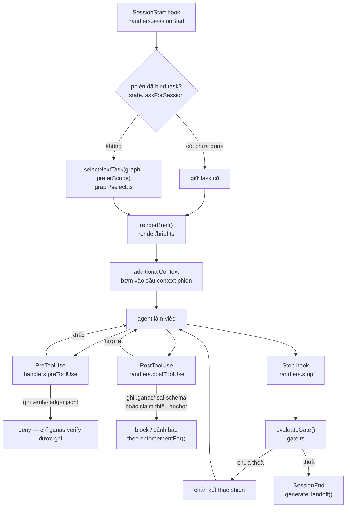
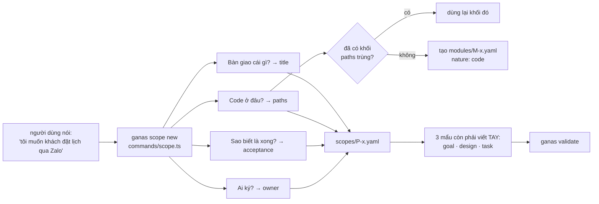
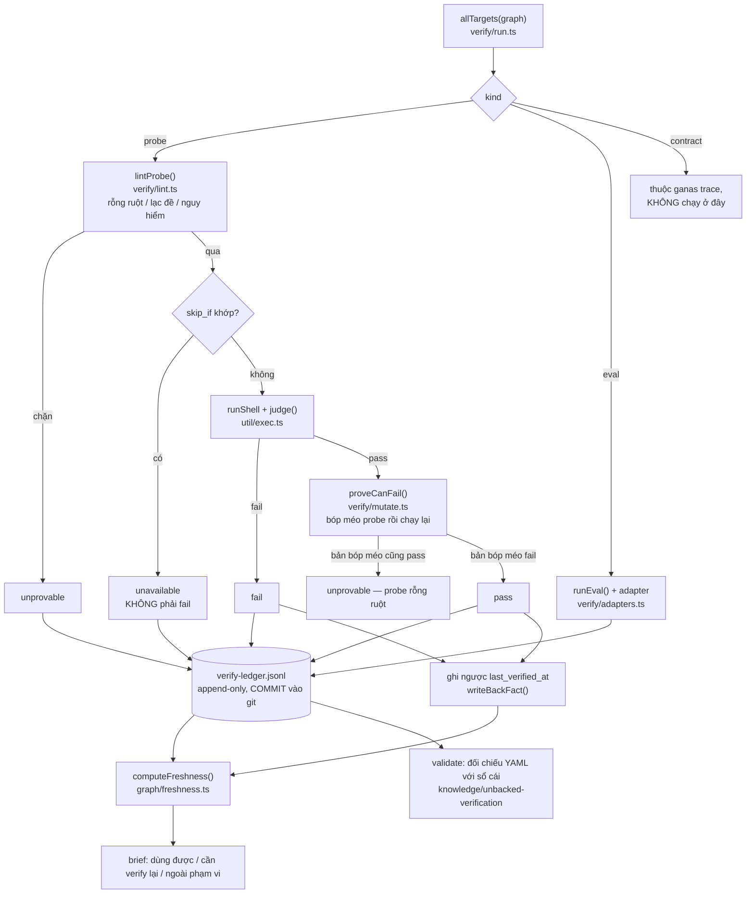
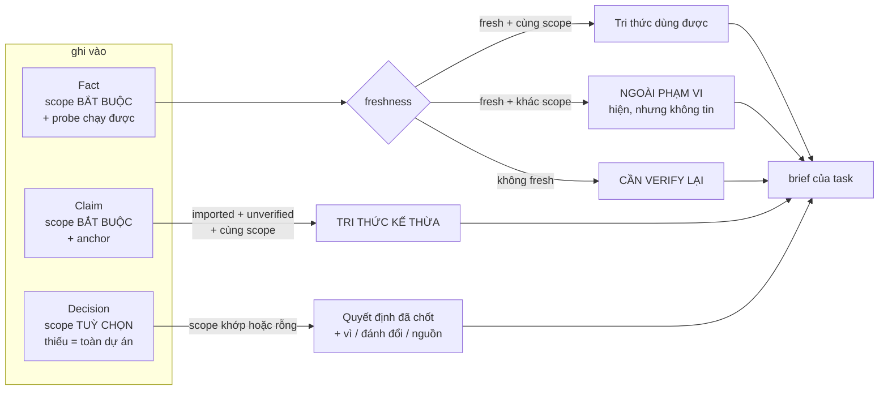
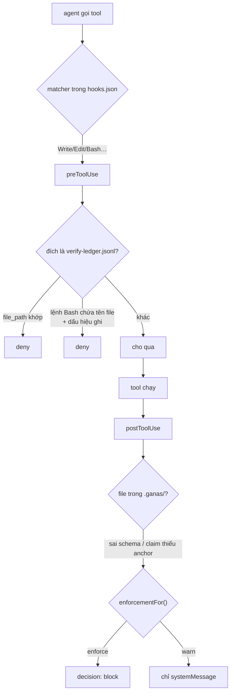

# Các luồng chính của ganas

Tài liệu này trả lời câu hỏi **"dữ liệu chạy qua đâu"** — khác với
`docs/CONCEPTS.md` (từng khái niệm là gì), `docs/COMMANDS.md` (từng cờ của từng
lệnh) và `docs/WORKFLOW.md` (một ngày làm việc, từng bước).

Mọi sơ đồ dưới đây vẽ theo **code hiện hành**, mỗi node ghi kèm hàm/file thật.
Nếu sơ đồ và code lệch nhau thì sơ đồ sai — sửa sơ đồ, đừng sửa trí nhớ.

Có **5 luồng**. Ba luồng đầu là xương sống; hai luồng sau là thứ khiến ganas
khác một trình quản lý task thông thường.

---

## 1. Luồng phiên — từ lúc mở tới lúc đóng

Đây là luồng người dùng không bao giờ gõ tay: hook của Claude Code gọi ganas ở
sáu thời điểm (`plugin/hooks/hooks.json` → `src/commands/hook.ts` → `HANDLERS`).

**Điểm đứt đã biết, ghi ở đây để không ai tưởng nó liền:** `generateHandoff()`
ghi `.ganas/runs/<session>.md`, nhưng **không code nào đọc lại file đó**.
`sessionStart` dựng brief thuần từ graph. Thứ duy nhất thật sự đi qua ranh giới
phiên là `state.current_task` (`src/state.ts`) và những gì đã được ghi thành
fact/claim trong `.ganas/`. Handoff hiện là bản ghi cho **người** đọc, không
phải cho phiên sau.

---

## 2. Luồng dịch — từ câu nói người dùng thành graph

Đây là luồng phục vụ mục tiêu của ganas: chuyển ngôn ngữ người dùng sang ngôn
ngữ quản lý dự án.

**Khoảng trống đã đo (P2 N18):** `scope new` phủ trục **hệ thống** (phạm vi +
khối). Trục **xương sống** (goal → design → task) vẫn phải viết tay — ba mẩu
YAML. Đây là con số đo thật từ repo trống, không phải ước lượng.

---

## 3. Luồng bằng chứng — vì sao `fresh` không tự khai được

Luồng quan trọng nhất của ganas. Điểm mấu chốt: **YAML sửa tay được, dòng sổ
cái thì không** (hook chặn ghi thẳng), nên `validate` đối chiếu được hai bên.

`computeFreshness` trả **một trong 11 lý do**, không phải một mức độ — vì "model
đã đổi" và "file đã sửa" dẫn tới hai hành động khác nhau. Chỉ `fresh` được coi
là dùng được (`isUsable`).

**Đã bịt ở P2 N21–N27:** `statement` nay nằm trong `defHash`; `proof` được ghi
vào sổ cái và `--no-mutation` không còn thành pass vĩnh viễn; độ cũ tính theo
**nội dung** file chứ không theo `mtime` (nên `touch -d` không đảo được);
`ttl_days` của fact thật sự hết hạn; `.ganas/config.yaml` được bảo vệ như sổ cái.

**Còn nợ, ghi thẳng để không quên:** `kind: eval` vẫn KHÔNG đi qua lint lẫn
mutation test (`run.ts` chỉ chạy chúng cho `kind: probe`) — mà eval chính là
bằng chứng bắt buộc của khối `nature: llm`. Và sổ cái vẫn chưa có hash chain:
`readLedger` mới ĐẾM được dòng hỏng, chưa phát hiện được ai sửa lịch sử bằng
`git checkout` một bản cũ.

---

## 4. Luồng tri thức — phạm vi là ranh giới

**Bất biến của luồng này, có test riêng khoá cả hai chiều:**

> Phạm vi dùng để **hạ cấp độ tin**, không bao giờ để **giấu**.

Fact ngoài phạm vi không bao giờ vào "Tri thức dùng được", nhưng **luôn** hiện ở
mục riêng. Giấu đi là đổi *ảo giác* lấy *quên* — cùng một tổn thất, khó phát
hiện hơn.

Chiều ngược lại cho Decision: mặc định của nó là **áp cho tất cả**, vì fact
ngoài phạm vi mà được tin thì sinh ảo giác, còn decision bị thu hẹp nhầm thì
model vi phạm một ràng buộc người đã chốt — tệ hơn.

---

## 5. Luồng cưỡng chế — hook chặn được gì, và không chặn được gì

**Nói thẳng giới hạn, vì tin nhầm vào hàng rào còn tệ hơn không có hàng rào:**

- Hook **fail-open** có chủ đích (`hooks/io.ts`, `plugin/bin/ganas.mjs` im lặng
  thoát 0 khi ganas hỏng). Công cụ hỏng không được biến thành hàng rào nhốt
  người dùng. Đổi lại: ganas hỏng = mất lớp kiểm soát, không ai được báo.
- Chặn ghi sổ cái khớp theo **chuỗi literal**. `node -e "…'verify-'+'ledger…'"`,
  biến shell, hay một tool MCP không khớp matcher đều lọt.
- `.ganas/config.yaml` **không được bảo vệ** — ghi `enforcement: warn` vào đó là
  tự tắt cả tầng cưỡng chế.

Kết luận đúng về mô hình này: ganas là **tamper-evident**, không phải
tamper-proof. Hook là lớp nhắc; cổng thật phải là CI chạy `ganas validate`.

---

## Làm sao biết sơ đồ này chưa mục?

Ba luật trong `test/no-dead-ends.test.ts` chạy cùng `npm test`, chặn bằng máy
đúng lớp lỗi đã gặp nhiều lần trong repo này:

| Luật | Chặn được gì | Ca thật đã bắt |
|---|---|---|
| Lệnh được nhắc phải tồn tại trong `COMMANDS` | chuỗi chỉ người dùng tới lệnh ma | `ganas adopt --audit` in vào brief **mỗi phiên** |
| Đường dẫn `.ganas/<x>/` phải có trong `DIRS` | trỏ vào thư mục không tồn tại | — |
| Mọi trường schema phải có người đọc ngoài `src/model/` | trường khai rồi không ai dùng | `Scope.window`, `Module.risk/survey/surveyed_at`, `Claim.created_at/imported_at`, `Decision.link/consequence` |

Chúng nằm trong **test** chứ không nằm trong `CONTRIBUTING.md` là có chủ đích:
một quy ước viết trong tài liệu sẽ mục ngay lần đầu có người quên, và không ai
đối chiếu lại.

**Giới hạn thành thật của bộ dò:** nó dò theo *văn bản*, không phân tích luồng
dữ liệu. Nó bắt được "nhắc tên thứ không có" và "khai rồi không ai đọc"; nó
**không** bắt được:

- *đọc đúng tên nhưng sai ngữ nghĩa* — `Fact.ttl_days` từng được đọc bằng
  `(target.definition as { ttl_days?: number })`, đúng chữ nhưng sai cấp object
  nên luôn `undefined`. Ép kiểu `as` đã vô hiệu hoá type checker.
- *trùng tên giữa hai type* — `Decision.context` bị bộ dò cho là "có người đọc"
  vì `target.context` (một type khác) tồn tại. Ca đó phải soi tay.

Hai chỗ đó là nơi cần đọc kỹ khi review, vì máy không đỡ được.
