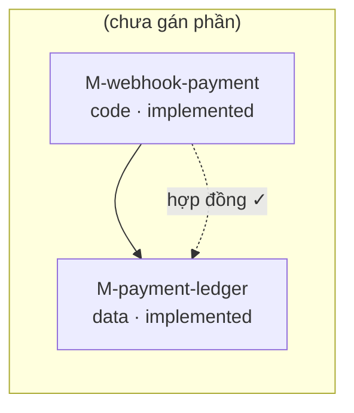

# Một ngày làm việc với ganas

Tài liệu này đi qua một luồng làm việc đầu-cuối, TỪNG BƯỚC: `ganas init` →
viết goal/design/task/khối → mở phiên (brief) → sửa code → verify → trace →
gate → commit → đánh dấu xong. Khác với `docs/CONCEPTS.md` (mô hình dữ liệu,
prose) và `docs/COMMANDS.md` (tham chiếu đầy đủ từng cờ) — file này là một
ví dụ CHẠY ĐƯỢC, không phải narrative viết theo trí nhớ.

**Mọi YAML và mọi lệnh dưới đây đã được chạy thật** trong một thư mục scratch
(`ganas init` + `git init` thật, không phải dự án ganas này) khi viết tài
liệu này, và output hiển thị là output THẬT nhận được (diễn giải bớt phần
nhiễu, không bịa thêm). Nếu bạn gõ lại đúng như dưới đây trong một thư mục
trống có `git`, kết quả sẽ giống hệt.

Ví dụ xuyên suốt: một dự án nhỏ xử lý **webhook xác nhận thanh toán** — cổng
thanh toán gọi webhook về, hệ thống phải chuẩn hoá payload thô rồi ghi vào sổ
quỹ. Cố tình chọn ví dụ nhỏ (2 khối, 1 task) để mọi YAML vừa một màn hình.

Về cách gõ lệnh: `package.json` khai `"bin": { "ganas": "./dist/cli.js" }`,
nên sau khi cài (`npm install -g` hoặc `npm link`) bạn gõ thẳng `ganas
<lệnh>`. Trong Claude Code, các lệnh này phần lớn tự chạy qua hook
(`plugin/hooks/hooks.json`: `SessionStart` gọi `hook session-start` —
tương đương `next`, `Stop` gọi `hook stop` — tương đương `gate`) hoặc qua
skill (`/next`, `/gate`, `/verify`, `/trace`, `/commit`) — bạn hiếm khi gõ
CLI trần tay. Tài liệu này gõ trần để mỗi bước và mỗi output đều nhìn thấy
được, kèm `--cwd <thư-mục-dự-án>` vì đang chạy trong dự án scratch riêng
ngoài luồng phiên bình thường.

## 1. `ganas init`

Trong một thư mục trống, đã có `git init` (ganas không tự làm việc này):

```
$ ganas init --project webhook-thanh-toan --owner nguyen-a
```

(bản thân khi viết tài liệu này còn thêm `--yes --cwd <tmp>` vì chạy
không tương tác — bỏ hai cờ đó nếu bạn gõ tay trong terminal thật).

Output thật:

```
ganas đã khởi tạo tại <cwd>

  tạo mới:  .ganas/config.yaml
            .ganas/README.md
            .ganas/state.json
            .claude/rules/ganas-knowledge.md
            .claude/rules/architecture.md
            CLAUDE.md
            AGENTS.md
            .ganas/goals/G-001.yaml
            .ganas/sprints/S-2026-08.yaml

Tiếp theo:
  1. Sửa .ganas/goals/G-001.yaml — mục tiêu thật và tiêu chí nghiệm thu thật
  2. ganas validate
```

`init` sinh sẵn một goal mẫu (`G-001`, `title: "Đặt tên mục tiêu ở đây"`) và
một sprint đang `active` phủ 2 tuần kể từ hôm nay — đủ để `ganas validate` có
gì mà kiểm ngay, không phải khởi tạo từ file rỗng. Việc của bạn ở bước sau là
**sửa** file goal mẫu đó, không phải tạo file mới.

## 2. Sửa goal thật

`.ganas/goals/G-001.yaml` — thay nội dung mẫu bằng mục tiêu thật, tiêu chí
nghiệm thu là một lệnh chạy được thật (không phải `echo` giữ chỗ như mẫu):

```yaml
id: G-001
title: "Xử lý webhook xác nhận thanh toán"
outcome: "Đơn hàng tự động chuyển sang trạng thái đã thanh toán ngay khi cổng thanh toán báo về, không cần kế toán đối soát tay"

acceptance:
  - id: A-1
    kind: command
    run: "node -e \"const {parseWebhook}=require('./src/webhook.js'); const r=parseWebhook({id:'evt_1',amount:150000,status:'paid'}); process.exit(r.status==='paid'?0:1)\""
    expect: exit_zero

status: active
approved_by: "@nguyen-a"
approved_at: 2026-08-01T16:45:36.157Z
```

Hai trường bắt buộc dễ quên: **`status: active` đòi `approved_by`** (goal
không được để model tự chốt — xem `src/model/goal.ts`), và **có
`approved_by` thì phải có `approved_at`** đi kèm. `init --owner nguyen-a` đã
điền sẵn cả hai nên ở đây chỉ cần giữ nguyên; nếu gọi `init` không có
`--owner`, goal sinh ra sẽ ở `status: draft` và bạn phải tự điền hai trường
này trước khi chuyển `active`.

Sprint mẫu `init` sinh sẵn (`.ganas/sprints/S-2026-08.yaml`) đã đúng ý —
`goals: [G-001]`, `status: active` — không cần sửa gì cho ví dụ này.

## 3. Viết design

Một task luôn hiện thực một design, và design luôn phục vụ một goal
(`serves` bắt buộc không rỗng — không có design trôi nổi). Tạo
`.ganas/designs/D-001.yaml`:

```yaml
id: D-001
title: "Chuẩn hoá webhook thanh toán trước khi ghi sổ quỹ"
serves:
  - G-001
summary: >
  Webhook cổng thanh toán gửi payload thô, tên trường và đơn vị tiền khác nhau
  tuỳ cổng. Thêm một khối thuần hàm (parseWebhook) chuẩn hoá payload thô thành
  một bản ghi thanh toán cố định (id, amount_cents, status), rồi mới đưa cho
  khối ghi sổ quỹ. Tách riêng bước chuẩn hoá để khối ghi sổ không phải biết gì
  về định dạng của từng cổng thanh toán.
status: active
```

## 4. Vẽ hai khối vào sơ đồ

Sơ đồ khối CHÍNH LÀ bản đồ hệ thống (xem `docs/CONCEPTS.md` cho lý do gộp hai
khái niệm làm một). Ví dụ này có hai khối, một cạnh `depends_on` giữa chúng:

`.ganas/modules/M-webhook-payment.yaml`:

```yaml
id: M-webhook-payment
title: "Chuẩn hoá webhook thanh toán"
nature: code
paths:
  - "src/webhook.js"
entrypoints:
  - "parseWebhook"

contract:
  inputs:
    - name: raw_payload
      shape: "{ id: string, amount: number, status: string }"
  outputs:
    - name: normalized_payment
      shape: "{ id: string, amount_cents: number, status: 'paid' | 'failed' }"

status: implemented
risk: medium

verify:
  - id: V-webhook-parse-smoke
    kind: probe
    tier: smoke
    run: "node -e \"const {parseWebhook}=require('./src/webhook.js'); const r=parseWebhook({id:'evt_1',amount:150000,status:'paid'}); if(r.id!=='evt_1'||r.amount_cents!==150000||r.status!=='paid') process.exit(1)\""
    expect: exit_zero
  - id: V-webhook-to-ledger
    kind: contract
    to: M-payment-ledger
```

`.ganas/modules/M-payment-ledger.yaml`:

```yaml
id: M-payment-ledger
title: "Ghi nhận thanh toán vào sổ quỹ"
nature: data
paths:
  - "src/ledger.js"
depends_on:
  - M-webhook-payment

contract:
  inputs:
    - name: normalized_payment
      shape: "{ id: string, amount_cents: number, status: 'paid' | 'failed' }"

status: implemented
risk: medium

verify:
  - id: V-ledger-append-smoke
    kind: probe
    tier: smoke
    run: "node -e \"const {appendPayment}=require('./src/ledger.js'); const rows=[]; appendPayment(rows,{id:'evt_1',amount_cents:150000,status:'paid'}); if(rows.length!==1) process.exit(1)\""
    expect: exit_zero
```

Ba điều đáng chú ý:

- `M-webhook-payment` có **hai** mục `verify`: một `kind: probe` (tất định,
  kiểm hành vi hàm) và một `kind: contract` (kiểm cổng ra của chính nó có
  phủ được cổng vào bắt buộc của `M-payment-ledger` không). Cạnh contract chỉ
  khai được ở khối NGUỒN, `to:` trỏ sang khối đích.
- Hai cổng phải khớp **cả tên lẫn `shape`** y hệt từng ký tự
  (`src/graph/trace.ts` so `out.shape.trim() !== input.shape.trim()`) — đây
  là lý do `normalized_payment` ở outputs của khối trước và inputs của khối
  sau được chép nguyên văn giống nhau.
- `status: implemented` đòi `paths` không rỗng (đã có) — khai `status:
  verified` mà `verify` rỗng thì `ganas validate` chặn ngay.

## 5. Viết task

`.ganas/tasks/T-001.yaml` — đây là chỗ nối trục VIỆC (task) với trục HỆ
THỐNG (khối): `touches` khai khối nào bị chạm, `exit_contract` phải có một
tiêu chí `kind: verification` cho MỖI khối trong `touches` (luật
`spine/task-missing-verification`, `src/graph/validate.ts`) — chạm khối mà
không để lại tiêu chí kiểm chứng thì task "xong" được mà chưa ai chạy
`ganas verify` lên khối đó.

```yaml
id: T-001
title: "Viết parseWebhook + appendPayment cho webhook thanh toán"
serves:
  - G-001
implements: D-001
sprint: S-2026-08
status: todo
estimated_context: small

context_contract:
  must_read:
    - path: ".ganas/designs/D-001.yaml"
      why: "Design nói rõ vì sao tách khối chuẩn hoá khỏi khối ghi sổ quỹ"
  facts: []
  open_questions: []

touches:
  - M-webhook-payment
  - M-payment-ledger

exit_contract:
  - kind: verification
    target: "M-webhook-payment/V-webhook-parse-smoke"
  - kind: verification
    target: "M-payment-ledger/V-ledger-append-smoke"
```

`target` của tiêu chí `verification` phải khớp đúng
`<id khối>/<id verify>` (hoặc chỉ `<id khối>` nếu muốn kiểm mọi bằng chứng
của khối, hoặc một fact id như `F-ACC-001`) — validator so bằng
`target === moduleId || target.startsWith(\`${moduleId}/\`)`.

## 6. `ganas validate`

```
$ ganas validate
```

Output thật, ngay lúc code (`src/webhook.js`, `src/ledger.js`) CHƯA tồn tại:

```
.ganas/modules/M-payment-ledger.yaml:1  cảnh báo  spine/module-without-part
  khối M-payment-ledger không thuộc phần nào — sẽ không nằm trong bộ bàn giao nào

.ganas/modules/M-webhook-payment.yaml:1  cảnh báo  spine/module-without-part
  khối M-webhook-payment không thuộc phần nào — sẽ không nằm trong bộ bàn giao nào

2 cảnh báo — 1 goal · 1 sprint · 1 design · 1 task · 0 phần · 2 khối · 0 fact · 0 claim
```

Không có lỗi (`error`), chỉ hai cảnh báo — hợp lý cho ví dụ nhỏ này: không
khai `parts/` (đơn vị đóng gói bàn giao) vì chỉ có hai khối lẻ, không phải
một bộ phát hành. `ganas validate` không chặn ở mức cảnh báo, thoát mã 0.
Dự án lớn hơn nên gán khối vào `parts/` để cảnh báo này biến mất.

## 7. Mở phiên — `ganas next`

```
$ ganas next
```

`next` chọn task kế tiếp (ở đây chỉ có T-001) và ghim nó vào
`.ganas/state.json` (`current_task`) — mọi lệnh sau đó (`gate`, `verify`,
`commit`...) không cần lặp lại ID task nữa. Output thật (rút gọn phần luật
ghi tri thức, giống nhau ở mọi brief):

```
# T-001 — Viết parseWebhook + appendPayment cho webhook thanh toán

sprint `S-2026-08` · design `D-001` · phục vụ `G-001`

## Mục tiêu đang phục vụ

### G-001 — Xử lý webhook xác nhận thanh toán

Kết quả mong đợi: Đơn hàng tự động chuyển sang trạng thái đã thanh toán ngay khi cổng thanh toán báo về, không cần kế toán đối soát tay

Nghiệm thu:
- `node -e "const {parseWebhook}=require('./src/webhook.js'); ..."`

## Design đang hiện thực

### D-001 — Chuẩn hoá webhook thanh toán trước khi ghi sổ quỹ
...

## Phải đọc trước khi sửa gì

- `.ganas/designs/D-001.yaml`
  Design nói rõ vì sao tách khối chuẩn hoá khỏi khối ghi sổ quỹ

## Khối chạm tới (suy từ sơ đồ)

- `M-webhook-payment` — Chuẩn hoá webhook thanh toán
  `src/webhook.js`, `parseWebhook`
- `M-payment-ledger` — Ghi nhận thanh toán vào sổ quỹ
  `src/ledger.js`

## Điều kiện hoàn thành

Stop hook sẽ chấm những mục dưới đây. **Chưa thoả thì phiên không kết thúc được.**

- [ ] bằng chứng `M-webhook-payment/V-webhook-parse-smoke`
- [ ] bằng chứng `M-payment-ledger/V-ledger-append-smoke`
```

Tiêu chí `kind: verification` hiện đúng tên target ở đây (nhãn `bằng chứng
\`<target>\``, cùng cách `ganas gate` in — xem mục 8), song song với
`command`/`artifact`/`handoff`/`manual`. Chưa `verify` lần nào thì brief chỉ
cho biết CÓ tiêu chí này, chưa nói nó đạt hay chưa — muốn biết trạng thái
thật (đạt/`chưa chạy lần nào`/`TRƯỢT`...) thì chạy `ganas gate` (mục 8), vì
brief không tự đi tra sổ cái cho từng tiêu chí, chỉ liệt tên.

## 8. `ganas gate` trước khi có code

Task đã ghim (`current_task: T-001`), gọi trần không cần ID:

```
$ ganas gate
```

```
Điều kiện hoàn thành của T-001:
  ✗ bằng chứng `M-webhook-payment/V-webhook-parse-smoke`
      chưa chạy lần nào — mới chỉ là niềm tin
  ✗ bằng chứng `M-payment-ledger/V-ledger-append-smoke`
      chưa chạy lần nào — mới chỉ là niềm tin

✗ Còn 2 tiêu chí chưa đạt.
```

(thoát mã 1) — đúng như kỳ vọng: hai khối chưa có bằng chứng nào từng chạy.
Đây là lúc thật sự bắt tay vào sửa code.

## 9. Sửa code

`src/webhook.js`:

```js
function parseWebhook(raw) {
  if (!raw || typeof raw.id !== "string") {
    throw new Error("payload thiếu id");
  }
  if (typeof raw.amount !== "number" || raw.amount < 0) {
    throw new Error("payload thiếu amount hợp lệ");
  }
  const status = raw.status === "paid" ? "paid" : "failed";
  return {
    id: raw.id,
    amount_cents: Math.round(raw.amount),
    status,
  };
}

module.exports = { parseWebhook };
```

`src/ledger.js`:

```js
function appendPayment(rows, payment) {
  if (!payment || typeof payment.id !== "string") {
    throw new Error("payment thiếu id");
  }
  rows.push({ ...payment, recorded_at: new Date().toISOString() });
  return rows;
}

module.exports = { appendPayment };
```

## 10. `ganas verify`

Chạy bằng chứng của từng khối đã chạm:

```
$ ganas verify M-webhook-payment
```

```
✓ M-webhook-payment/V-webhook-parse-smoke đạt
⚠ M-webhook-payment/V-webhook-to-ledger chưa chứng minh được
    kiểm tương thích cạnh thuộc `ganas trace`

2 target · 1 đạt · 1 chưa chứng minh được
```

(thoát mã 1, vì còn một mục `⚠`) — đây KHÔNG phải lỗi cần sửa code: mục
`kind: contract` cố tình bị `ganas verify` từ chối chấm, vì nó thuộc phạm vi
của lệnh khác (mục 11). Probe thường (`V-webhook-parse-smoke`) thì đã đạt.

```
$ ganas verify M-payment-ledger
```

```
✓ M-payment-ledger/V-ledger-append-smoke đạt

1 target · 1 đạt
```

(thoát mã 0). Mỗi lần `verify` chạy để lại một dòng trong
`.ganas/verify-ledger.jsonl` — đây là nơi DUY NHẤT `last_verified_at`/
`last_result` được ghi; sửa tay hai trường này bị `ganas validate` bắt là
`unbacked-verification`.

## 11. `ganas trace`

```
$ ganas trace
```

`````
✓ M-webhook-payment/V-webhook-to-ledger → M-payment-ledger



Không có nợ kiểm chứng nào trong sơ đồ.
`````

(thoát mã 0). Cạnh `depends_on` (nét liền) và cạnh đã kiểm hợp đồng (nét
đứt, nhãn `hợp đồng ✓`) cùng in ra — dán khối mermaid này thẳng vào một file
`.md` để xem trực quan. Vì hai cổng đã khớp tên+shape ở bước 4, `checkEdge`
không cần chạy thêm lệnh `run` nào (không khai `run:` trong verification này)
— kết quả `pass` chỉ từ so cổng khai báo.

## 12. `ganas gate` sau khi có code

```
$ ganas gate
```

```
Điều kiện hoàn thành của T-001:
  ✓ bằng chứng `M-webhook-payment/V-webhook-parse-smoke`
  ✓ bằng chứng `M-payment-ledger/V-ledger-append-smoke`

✓ Mọi tiêu chí chấm tự động đều đạt.
```

(thoát mã 0). Cả hai tiêu chí giờ đọc `last_result` từ sổ cái đã ghi ở
bước 10 — `gate` không tự chạy lại verify, nó chỉ ĐỌC kết quả đã có (và sẽ
báo "chưa chạy lần nào" nếu bạn chưa từng `verify`, kể cả khi code đã đúng).

## 13. `ganas commit`

Xem trước message, KHÔNG commit:

```
$ ganas commit --dry-run
```

```
--- commit message (dry-run, chưa commit) ---
T-001: Viết parseWebhook + appendPayment cho webhook thanh toán

Điều kiện hoàn thành:
  ✓ bằng chứng `M-webhook-payment/V-webhook-parse-smoke`
  ✓ bằng chứng `M-payment-ledger/V-ledger-append-smoke`

phục vụ G-001 · design D-001 — Chuẩn hoá webhook thanh toán trước khi ghi sổ quỹ · sprint S-2026-08
```

**Lưu ý một hành vi thật, dễ hiểu nhầm:** `--dry-run` chỉ bỏ qua bước
`git commit` cuối cùng — bước `git add` phạm vi task (`.ganas/` + `paths`
của mọi khối trong `touches`, ở đây là `src/webhook.js` và `src/ledger.js`)
vẫn chạy thật kể cả ở chế độ dry-run (`src/commands/commit.ts`). Không phải
lỗi — chỉ là dry-run ở đây nghĩa là "chưa tạo commit", không phải "không
đụng gì tới git".

Commit thật:

```
$ ganas commit
```

```
✓ Đã commit cho T-001.

T-001: Viết parseWebhook + appendPayment cho webhook thanh toán

Điều kiện hoàn thành:
  ✓ bằng chứng `M-webhook-payment/V-webhook-parse-smoke`
  ✓ bằng chứng `M-payment-ledger/V-ledger-append-smoke`

phục vụ G-001 · design D-001 — Chuẩn hoá webhook thanh toán trước khi ghi sổ quỹ · sprint S-2026-08
```

`git log --oneline` sau lệnh này có đúng một commit mới:
`T-001: Viết parseWebhook + appendPayment cho webhook thanh toán`. Message
không có dòng "Co-Authored-By" hay nhắc AI/Claude — đây là quy ước cứng của
`ganas commit`, không phải tuỳ chọn. Phạm vi `git add` KHÔNG phải `-A`: file
scaffold của `init` (`CLAUDE.md`, `AGENTS.md`, `.claude/`, `.gitignore`) vẫn
đứng ngoài staging vì không nằm trong `touches` của T-001 — commit của một
task chỉ chứa đúng phạm vi task đó.

Nếu `ganas gate` chưa đạt, `ganas commit` từ chối luôn, không tạo commit
rỗng lỡ dở:

```
Chưa commit được — điều kiện hoàn thành của T-001 chưa thoả:
...
```

## 14. Đánh dấu task xong

Không có lệnh CLI riêng cho việc này — sau khi gate đạt và đã commit, sửa
tay `status`/`done_at` trong `.ganas/tasks/T-001.yaml`:

```yaml
status: done
done_at: 2026-08-01T17:30:00.000Z
```

(`ganas validate` bắt lỗi nếu `status: done` mà thiếu `done_at` —
`src/model/task.ts`). Chạy lại `ganas validate` để chắc chắn: vẫn chỉ còn
hai cảnh báo `spine/module-without-part` như bước 6, không lỗi mới.

Task `done` đủ tuổi (mặc định 7 ngày) sẽ được `ganas prune` archive sang
`.ganas/tasks/done/` ở một phiên dọn dẹp sau — không phải việc của hôm nay.

## Tổng kết trình tự

```
ganas init
  → sửa .ganas/goals/G-001.yaml (mục tiêu + approved_by/approved_at)
  → viết .ganas/designs/D-001.yaml (serves goal)
  → viết .ganas/modules/*.yaml (contract vào/ra, verify)
  → viết .ganas/tasks/T-001.yaml (touches + exit_contract kind:verification)
  → ganas validate
  → ganas next            (mở phiên, đọc brief)
  → ganas gate             ✗ (chưa có code)
  → sửa code
  → ganas verify <khối>    (ghi sổ cái)
  → ganas trace            (kiểm cạnh contract, xem sơ đồ)
  → ganas gate             ✓ (đạt)
  → ganas commit
  → sửa status: done trong task YAML
```

Xem `docs/CONCEPTS.md` để hiểu SÂU từng khái niệm (Goal, Design, Task,
Module/Part, Fact/Claim/Decision, ledger, freshness) và `docs/COMMANDS.md`
để tra đầy đủ cờ của từng lệnh dùng ở trên.
